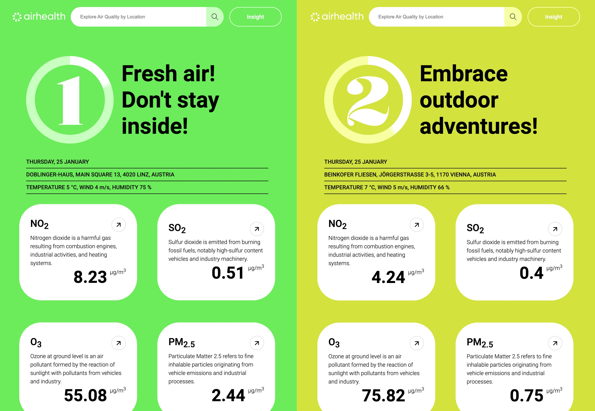

# AirHealth - Going out? Check air quality!

<h1 align="center"><a href='https://airhealth.netlify.app/' target='_blank' rel='noopener noreferrer'>
airhealth.netlify.app</a></h1>

# About

AirHealth is dedicated to providing current and accessible air pollution data, empowering informed decisions for well-being. As air pollution significantly impacts health and the environment, AirHealth's mission is to raise awareness and enable a better understanding of air quality data for informed health choices.

# Features

- Real-time Data: Access up-to-date air pollution data globally.
- Comprehensive Pollutants: Monitor various pollutants for a thorough understanding.
- User-Friendly Interface: Easily navigate and explore air quality information.
- Location-based Data: Receive personalized air quality details based on your location.

# How to use

Desktop Experience:

- Upon your initial visit, your browser may ask to use your location. Please select 'Allow' for personalized air quality information.

Allow a few moments for the data to be fetched, ensuring accurate and personalized information.

Mobile Experience:

- Enter a specific location for comprehensive air quality details.
  Provide precise locations with exact addresses for the best results.

Examples:

- Bad Address: Vienna, Austria
- Good Address: Stephansplatz 1, 1010 Vienna, Austria

# Thanks to

<a href="https://openweathermap.org/" target='_blank' rel='noopener noreferrer'>OpenWeather Air Pollution API

<a href="https://opencagedata.com/" target='_blank' rel='noopener noreferrer'>OpenCage Geocoding API

# Live app

Check live app here: 
 <a href='https://airhealth.netlify.app/' target='_blank' rel='noopener noreferrer'>https://airhealth.netlify.app/</a>
